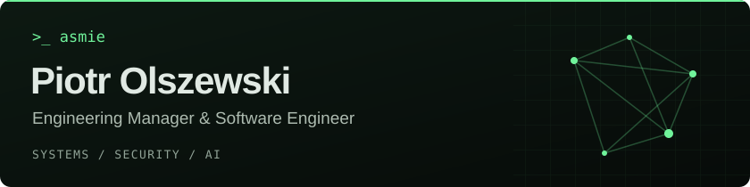

  

  <a href="https://asmie.pl">Website</a> &nbsp;·&nbsp;
  <a href="https://techrunes.dev">TechRunes</a> &nbsp;·&nbsp;
  <a href="https://www.linkedin.com/in/piotr-olszewski-8a239939/">LinkedIn</a> &nbsp;·&nbsp;
  <a href="mailto:asmie@asmie.pl">Email</a>

I’m Piotr, a software engineer and engineering leader from Poland. I build software and lead teams, with roots in **embedded systems, networking, and security**.

Currently working on **agentic engineering, AI, and blockchain** at Eiger, and running **TechRunes**, my software and consulting business.

**My toolkit** &nbsp; `Rust` · `C` · `C++` · `Python` · `C#` · `Go`

### Selected work

| Project | What it does |
| :--- | :--- |
| **[stamp-suite](https://github.com/asmie/stamp-suite)** · Rust | Measure network latency and packet loss with STAMP. |
| **[dlep](https://github.com/asmie/dlep)** · Rust | Exchange link information between routers and radio modems. |
| **[roll](https://github.com/asmie/roll)** · C++23 | Generate binary deltas using rolling hashes. |

Beyond the editor: astronomy, genealogy, geocaching, and strategy games.
